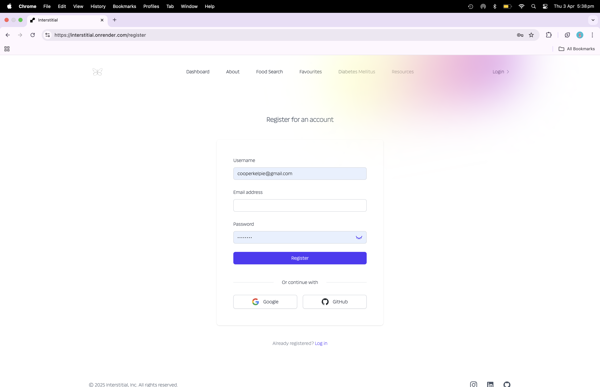
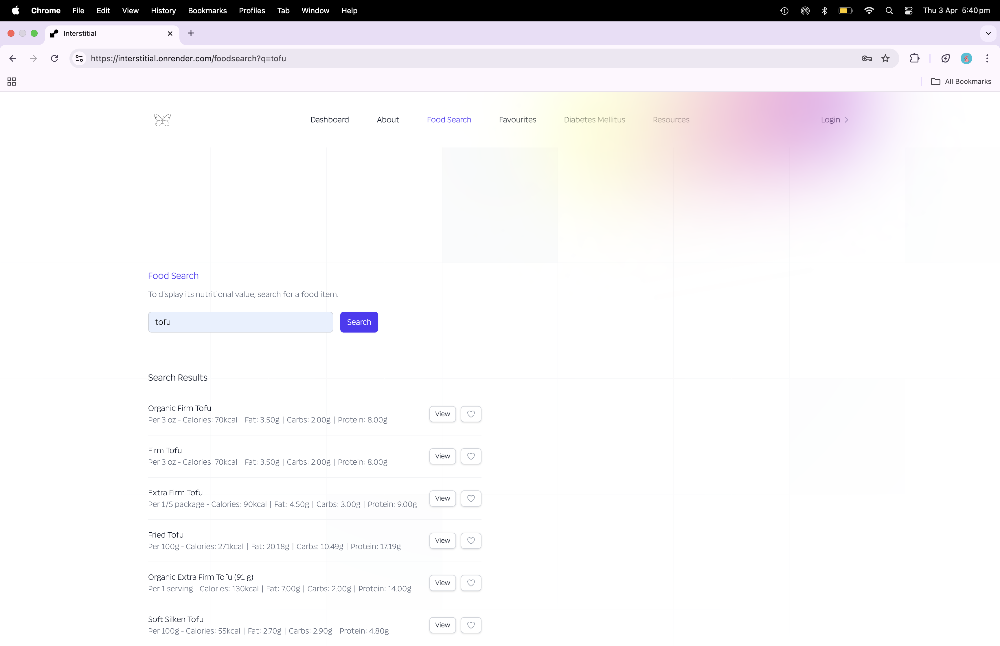
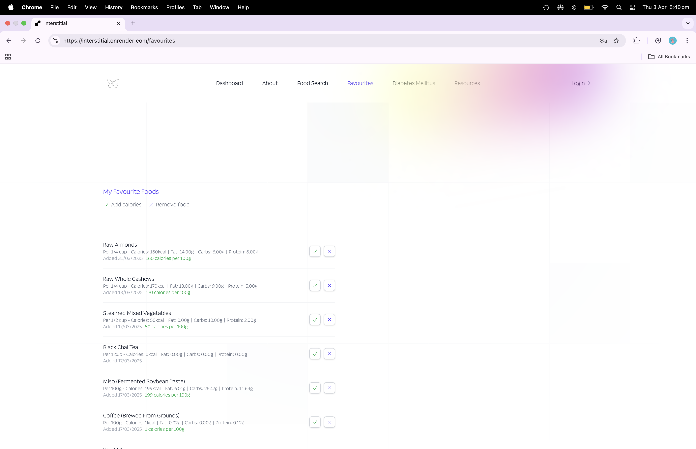
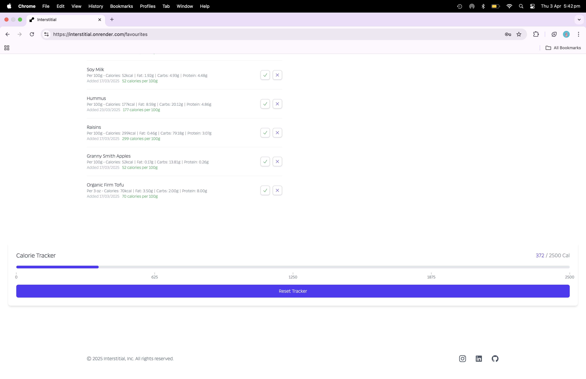
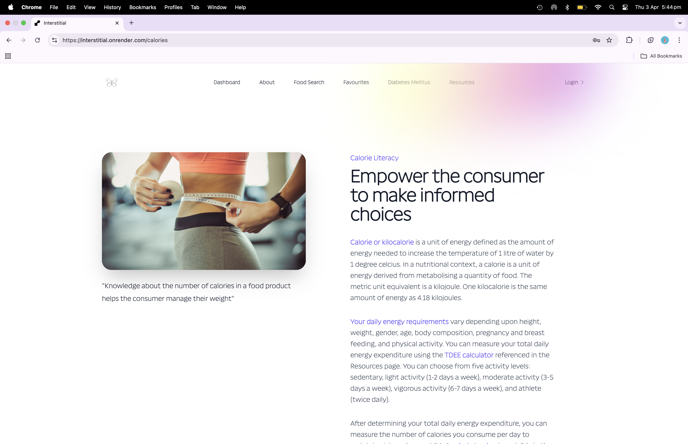

# Interstitial

## Table of Contents

- [Description](#description)
- [Installation](#installation)
- [Usage](#usage)
- [License](#license)
- [Contributing Guidelines](#contributing-guidelines)
- [Testing](#testing)
- [Authors and Acknowledgements](#authors-and-acknowledgements)

## Description

A full-stack health app featuring vite + react + tailwindcss + mongoDB + mongoose and calling a nutrition API with user authentication

## Installation

1. Create package.json for root directory and install dependencies:

```zsh
npm install express dotenv mongoose colors express-async-handler bcryptjs jsonwebtoken
npm install nodemon --save-dev
```
Add the following scripts:

```javascript
"scripts": {
    "start": "node server/server.js",
    "server": "nodemon server/server.js"
  }
```

2. In root directory create .gitignore file and add:

node_modules
.env

3. In root directory create .env file:

```javascript
NODE_ENV = development
PORT = 3001
```

4. Generate secret token for JWT

```zsh
node -e "console.log(require('crypto').randomBytes(64).toString('hex'))"
```
5. In server directory, create the following folders:
- `config`
- `controllers`
- `middleware`
- `models`
- `utils`

6. In server.js, define routes and middleware:

```javascript
app.use('/api/food', foodRoutes);
app.use ('/api/user', userRoutes);
app.use(express.json());
```

7. In client directory, initialize a new Vite + React project:

```zsh
cd client
npm create vite@latest
```
8. In client directory, install dependancies:

```zsh
cd interstitial-vite
npm install
npm run dev
```

9. In client directory, install Tailwind CSS and its dependancies:

```zsh
npm install -D tailwindcss postcss autoprefixer
```
10. In client directory, initialise Tailwind CSS:

```zsh
npx tailwindcss init -p
```
11. Update tailwind.config.js file to specify the paths to template files:

```javascript
export default {
      content: [
        "./index.html",
        "./src/**/*.{js,ts,jsx,tsx}",
      ],
      theme: {
        extend: {},
      },
      plugins: [],
    }
```

12. Create a CSS file src/index.css and add @tailwind directives:

```css
@tailwind base;
@tailwind components;
@tailwind utilities;
```
13. In client directory delete App.css and vite.svg.

14. In `client/src`, create the following folders:
- `components` 
- `context`
- `hooks`
- `pages`
- `routes`
- `utils` 

15. In client directory, install:

```zsh
npm install react-router-dom @tailwindcss/forms @tailwindcss/line-clamp
```


## Usage

Link to render deployment:

[interstitial](https://interstitial.onrender.com/)

Screenshots of app demonstrating functionality:

### screenshot-1


### screenshot-2



### screenshot-3



### screenshot-4



### screenshot-5



### screenshot-6




## License

[](https://opensource.org/licenses/MIT)

## Contributing Guidelines

Create a new branch for the commit and start a pull request.

## Testing

## Authors and Acknowledgements

[email] (ginadrcoder@gmail.com)

[email] (mitchjoelklein@hotmail.com)

## Questions

For enquiries, please contact me at:

[email] (ginadrcoder@gmail.com)

[github] (https://github.com/gina-t)
